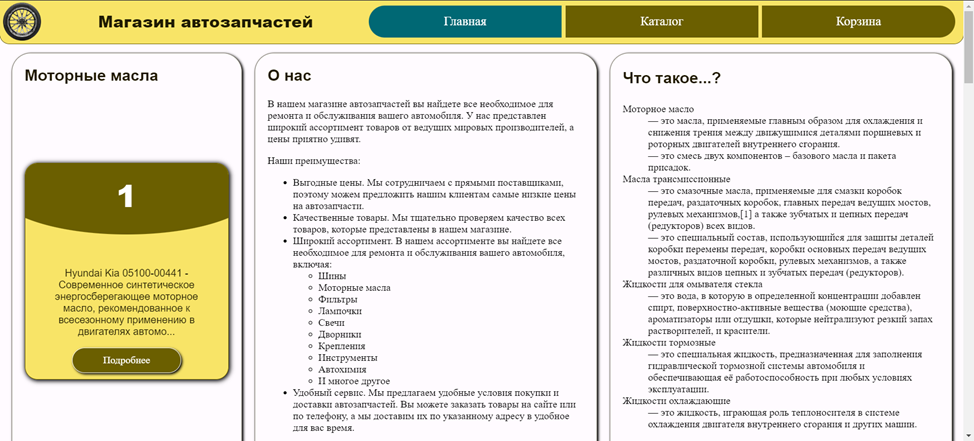
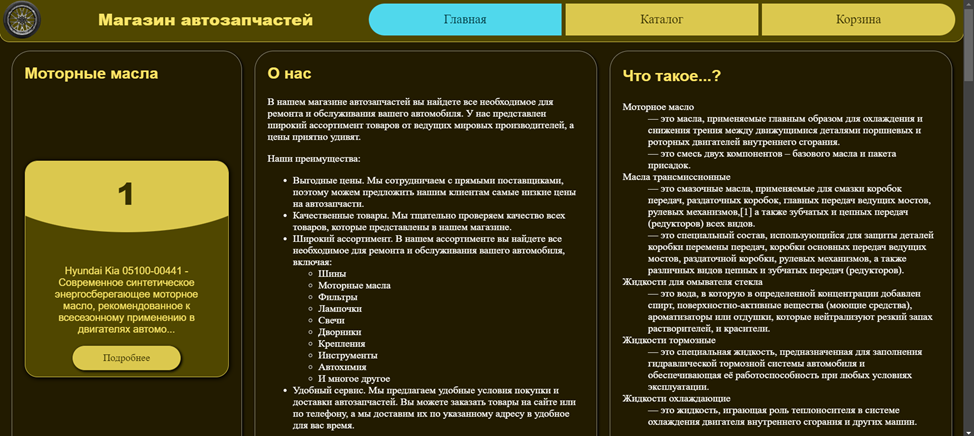

# Auto parts website fronted

Coursework in frontend discipline, RTU MIREA

## Stack

- html-css-javascript
- [Material design colors builder](https://material-foundation.github.io/material-theme-builder/)

## Screenshots

